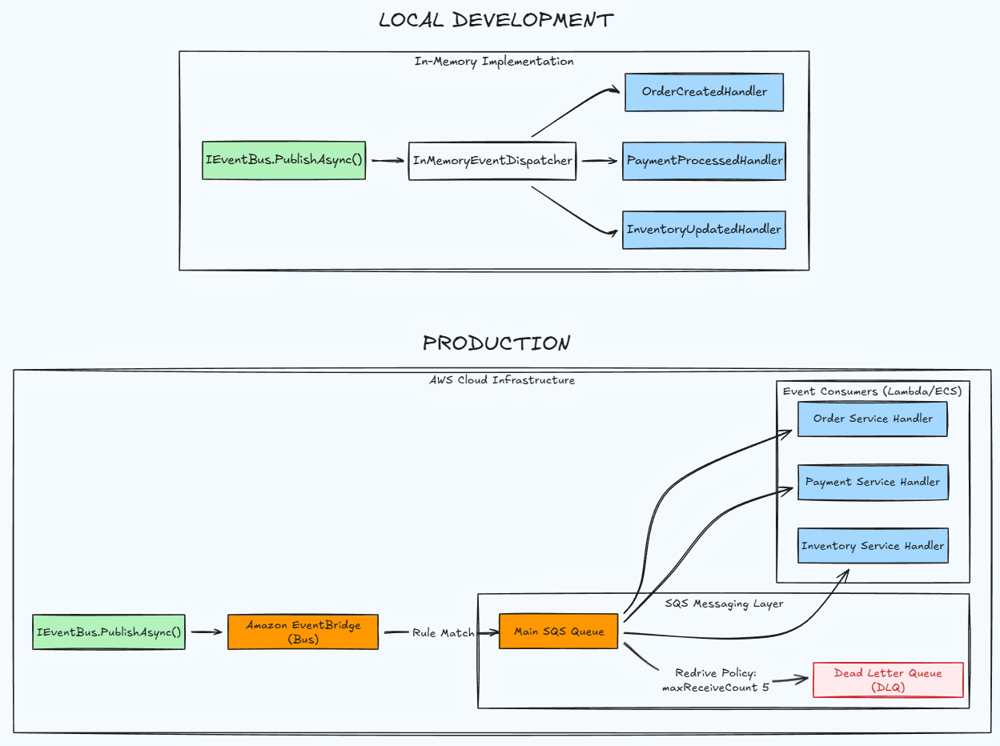

# Event Bus

The Event Bus provides asynchronous communication between modules using integration events.

## Architecture



## Components

| Component | Purpose |
|-----------|---------|
| `IEventBus` | Publish integration events |
| `IEventDispatcher` | Route events to handlers |
| `IIntegrationEventHandler<T>` | Handle incoming events |
| `InMemoryEventBus` | Development: synchronous dispatch |
| `EventBridgeEventBus` | Production: publish to AWS EventBridge |
| `ResilientEventBridgeEventBus` | Production: adds resilience patterns (retry, circuit breaker, timeout) |
| `SqsPollingJobBase` | Production: poll SQS for events |

## Usage

### Publishing Events

```csharp
// In a domain event handler or application service
await eventBus.PublishAsync(
    new OrderCreatedIntegrationEvent(...),
    cancellationToken);
```

### Handling Events

```csharp
// In the consuming module's Application layer
internal sealed class OrderCreatedHandler(ILogger<OrderCreatedHandler> logger)
    : IIntegrationEventHandler<OrderCreatedIntegrationEvent>
{
    public Task HandleAsync(OrderCreatedIntegrationEvent @event, CancellationToken ct)
    {
        ...
        return Task.CompletedTask;
    }
}
```

## Configuration

### Development

No configuration needed. `InMemoryEventBus` is automatically registered.

### Production

```json
{
  "AwsMessaging": {
    "EventBusName": "rtl-core-events",
    "EventSource": "Rtl.Core",
    "SqsQueueUrl": "https://sqs.us-east-1.amazonaws.com/123456789/my-module-queue",
    "PollingIntervalSeconds": 5,
    "MaxMessages": 10,
    "VisibilityTimeoutSeconds": 30
  }
}
```

## Module Setup

Each module needs:

1. **Integration event handlers** in `Application/IntegrationEvents/`
2. **SQS polling job** in `Infrastructure/EventBus/`

```csharp
// Infrastructure/EventBus/ProcessSqsJob.cs
internal sealed class ProcessSqsJob(
    IAmazonSQS sqsClient,
    IEventDispatcher eventDispatcher,
    IOptions<AwsMessagingOptions> options,
    IFeatureFlagService featureFlagService,
    ILogger<ProcessSqsJob> logger)
    : SqsPollingJobBase(sqsClient, eventDispatcher, options, featureFlagService, logger)
{
    protected override string ModuleName => "MyModule";
}
```

```csharp
// In module registration
services.AddIntegrationEventHandlers(Application.AssemblyReference.Assembly);
services.AddSqsPolling<ProcessSqsJob>(environment);
```

## Idempotency

Handlers **must be idempotent** because SQS provides at-least-once delivery.

| Pattern | Example |
|---------|---------|
| Upsert | `INSERT ... ON CONFLICT DO UPDATE` |
| Check-then-act | `if (!exists) { create(); }` |
| Idempotency key | Store processed event IDs |

## Flow

```
Publishing Module                    Consuming Module
─────────────────                    ────────────────
1. Save entity (DB)
2. Save to outbox (same tx)
3. ProcessOutboxJob runs
4. IEventBus.PublishAsync()
        │
        ▼
   [EventBridge]
        │
        ▼
   [SQS Queue] ◄─── 5. ProcessSqsJob polls
        │
        ▼
   EventDispatcher ──→ 6. Handler invoked
```

## Resilience

In production, the `EventBridgeEventBus` is wrapped with `ResilientEventBridgeEventBus`, which adds:

| Pattern | Purpose |
|---------|---------|
| **Timeout** | Prevents hanging on slow/stalled AWS calls |
| **Retry** | Handles transient failures with exponential backoff |
| **Circuit Breaker** | Fails fast when EventBridge is unavailable |

### Resilience Pipeline

```
PublishAsync()
    │
    ▼
┌─────────────────────────────────────────────┐
│ Total Timeout (30s)                         │
│   └─→ Retry (3 attempts, exponential)       │
│         └─→ Circuit Breaker (20% threshold) │
│               └─→ Attempt Timeout (10s)     │
│                     └─→ EventBridge API     │
└─────────────────────────────────────────────┘
```

### Configuration

```json
{
  "Resilience": {
    "Retry": {
      "MaxRetryAttempts": 3,
      "BaseDelayMilliseconds": 1000,
      "UseJitter": true
    },
    "CircuitBreaker": {
      "SamplingDurationSeconds": 10,
      "FailureRatio": 0.2,
      "MinimumThroughput": 3,
      "BreakDurationSeconds": 30
    },
    "Timeout": {
      "TotalTimeoutSeconds": 30,
      "AttemptTimeoutSeconds": 10
    }
  }
}
```

### Failure Behavior

| Scenario | What Happens |
|----------|--------------|
| Slow response | Attempt times out → retry with backoff |
| Transient error | Retry with exponential backoff + jitter |
| Repeated failures | Circuit opens → fail fast for 30s |
| Circuit open | `BrokenCircuitException` thrown immediately |

The outbox pattern ensures events are retried even if resilience exhausts all attempts.

See [Resilience README](../Resilience/README.md) for full documentation.

## Related Documentation

- [Resilience Patterns](../Resilience/README.md) - Circuit breaker, retry, timeout details
- [Outbox Pattern](../Outbox/README.md) - Reliable event publishing
